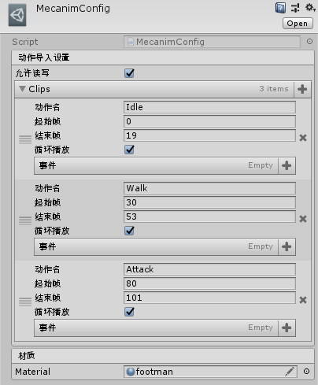
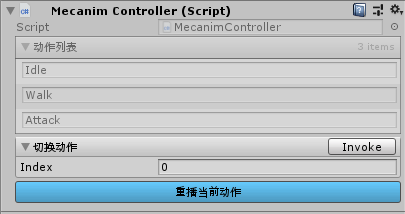

## MecanimConfig

MecanimConfig是一个自定义的导入配置。常见的工作流为：

1. 美术在3dMax等建模工具中完成模型和动作编辑，导出FBX。
2. 在unity中创建一个MecanimConfig。
3. 配置各个动作的帧信息和事件。
4. 导入步骤1中的FBX。

该配置会被预处理程序读取并完成以下功能：

- 读取FBX中的信息并根据美术的参数进行单个动作的切割。
- 创建Animator和多个状态并关联到对应的动作。
- 设置各状态切换（对应动作的切换）的触发参数。

## MecanimController

配合MecanimConfig使用的运行时组件。创建预设时会将动作信息保存到此对象中，用于运行时调用处理。提供如下功能：

- 切换动作。
- 重播当前动作。

